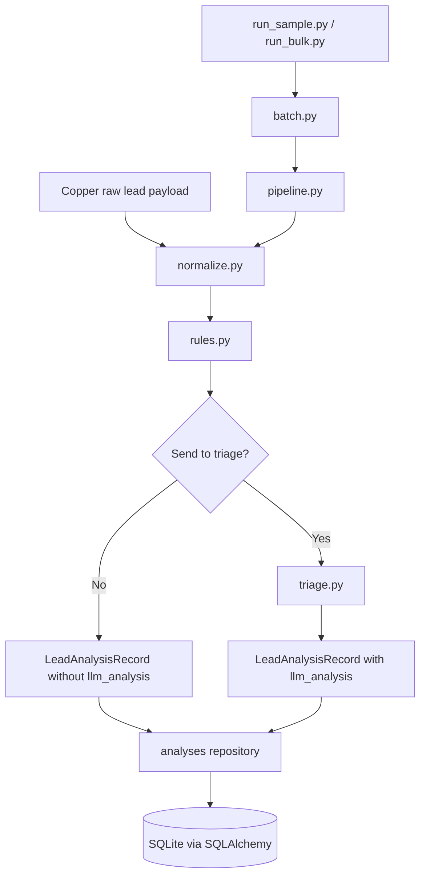
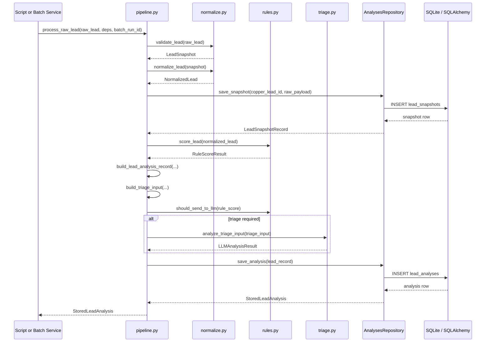
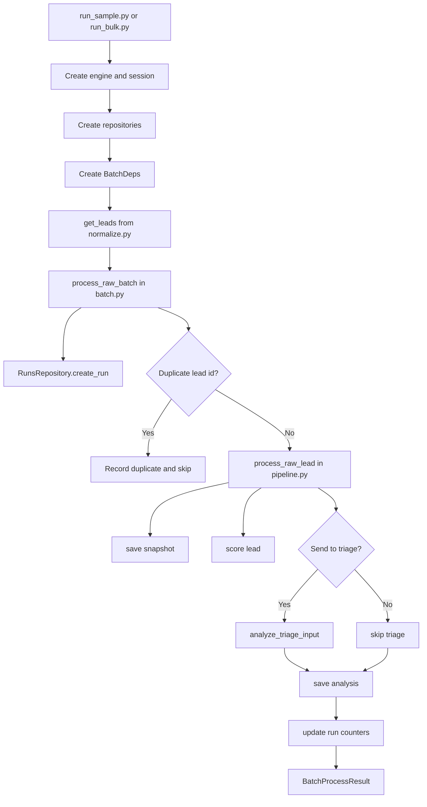

# Lead Triage Engine — System Flow

**Created:** 2026-04-19
**Modified:** 2026-04-19
**Version:** 1.0

**Status:** Active implementation reference
**Related Docs:** [app_architecture.md](/Users/jamesfilios/Software_Projects/copper-lead-triage/docs/app_architecture.md), [build_plan.md](/Users/jamesfilios/Software_Projects/copper-lead-triage/docs/build_plan.md)

---

## Purpose

This document shows how the current backend works end to end as of 2026-04-19. It is meant to make the functional flow visible across modules, services, repositories, and scripts.

Use this document when you want to answer questions like:

- where does raw lead data enter the system?
- when do rules run versus triage?
- when does the database get written to?
- how do batch runs call the per-lead pipeline?
- which file owns which step?

---

## Current Runtime Layers

The codebase currently has five working backend layers:

1. input and normalization
2. deterministic rules
3. triage LLM task
4. persistence
5. per-lead and batch orchestration

The API layer and review workflow are still later phases.

---

## High-Level Diagram

---

## Code Ownership Map

### Input and Normalization

- [backend/app/services/normalize.py](/Users/jamesfilios/Software_Projects/copper-lead-triage/backend/app/services/normalize.py)
  - `get_leads(...)`
  - `validate_lead(...)`
  - `normalize_lead(...)`
  - `return_normalized_leads(...)`

### Deterministic Rules

- [backend/app/services/rules.py](/Users/jamesfilios/Software_Projects/copper-lead-triage/backend/app/services/rules.py)
  - `score_lead(...)`
  - `should_send_to_llm(...)`

### Triage LLM Task

- [backend/app/services/triage.py](/Users/jamesfilios/Software_Projects/copper-lead-triage/backend/app/services/triage.py)
  - `should_run_triage(...)`
  - `build_gate_reason(...)`
  - `build_triage_deps(...)`
  - `build_triage_prompt(...)`
  - `analyze_triage_input(...)`
  - `analyze_triage_input_sync(...)`
  - `get_triage_service_metadata(...)`

- [backend/app/clients/llm.py](/Users/jamesfilios/Software_Projects/copper-lead-triage/backend/app/clients/llm.py)
  - `get_triage_model(...)`
  - `get_triage_model_metadata(...)`

### Persistence

- [backend/app/models/db.py](/Users/jamesfilios/Software_Projects/copper-lead-triage/backend/app/models/db.py)
  - `create_database_engine(...)`
  - `create_session_factory(...)`
  - `initialize_database(...)`
  - ORM models: `BatchRunORM`, `LeadSnapshotORM`, `LeadAnalysisORM`, `ReviewDecisionORM`
  - typed DB-facing models: `BatchRun`, `LeadSnapshotRecord`, `StoredLeadAnalysis`, `ReviewDecision`

- [backend/app/repositories/analyses.py](/Users/jamesfilios/Software_Projects/copper-lead-triage/backend/app/repositories/analyses.py)
  - `save_snapshot(...)`
  - `save_analysis(...)`
  - `get_latest_analysis(...)`
  - `list_analyses_for_run(...)`
  - `update_review_status(...)`

- [backend/app/repositories/runs.py](/Users/jamesfilios/Software_Projects/copper-lead-triage/backend/app/repositories/runs.py)
  - `create_run(...)`
  - `get_run(...)`
  - `list_runs(...)`
  - `update_run(...)`

- [backend/app/repositories/reviews.py](/Users/jamesfilios/Software_Projects/copper-lead-triage/backend/app/repositories/reviews.py)
  - `create_review_decision(...)`
  - `get_review_history(...)`

### Per-Lead Orchestration

- [backend/app/services/pipeline.py](/Users/jamesfilios/Software_Projects/copper-lead-triage/backend/app/services/pipeline.py)
  - `PipelineDeps`
  - `build_lead_analysis_record(...)`
  - `build_triage_input(...)`
  - `process_normalized_lead(...)`
  - `process_raw_lead(...)`

### Batch Orchestration

- [backend/app/services/batch.py](/Users/jamesfilios/Software_Projects/copper-lead-triage/backend/app/services/batch.py)
  - `BatchDeps`
  - `BatchFailure`
  - `BatchProcessResult`
  - `_update_run_progress(...)`
  - `process_raw_batch(...)`
  - `process_normalized_batch(...)`

### Runner Scripts

- [backend/scripts/run_sample.py](/Users/jamesfilios/Software_Projects/copper-lead-triage/backend/scripts/run_sample.py)
  - `parse_args(...)`
  - `main(...)`

- [backend/scripts/run_bulk.py](/Users/jamesfilios/Software_Projects/copper-lead-triage/backend/scripts/run_bulk.py)
  - `parse_args(...)`
  - `main(...)`

---

## Per-Lead Functional Flow

### Raw Lead Path

The main per-lead entrypoint is `process_raw_lead(...)` in [pipeline.py](/Users/jamesfilios/Software_Projects/copper-lead-triage/backend/app/services/pipeline.py).

It currently runs this sequence:

1. `validate_lead(raw_lead)` in [normalize.py](/Users/jamesfilios/Software_Projects/copper-lead-triage/backend/app/services/normalize.py)
2. `normalize_lead(validated_lead)` in [normalize.py](/Users/jamesfilios/Software_Projects/copper-lead-triage/backend/app/services/normalize.py)
3. `save_snapshot(copper_lead_id, raw_payload)` in [analyses.py](/Users/jamesfilios/Software_Projects/copper-lead-triage/backend/app/repositories/analyses.py)
4. `process_normalized_lead(...)` in [pipeline.py](/Users/jamesfilios/Software_Projects/copper-lead-triage/backend/app/services/pipeline.py)

### Normalized Lead Path

`process_normalized_lead(...)` then runs this sequence:

1. `score_lead(normalized_lead)` in [rules.py](/Users/jamesfilios/Software_Projects/copper-lead-triage/backend/app/services/rules.py)
2. `build_lead_analysis_record(...)` in [pipeline.py](/Users/jamesfilios/Software_Projects/copper-lead-triage/backend/app/services/pipeline.py)
3. `build_triage_input(record)` in [pipeline.py](/Users/jamesfilios/Software_Projects/copper-lead-triage/backend/app/services/pipeline.py)
4. `should_send_to_llm(score)` in [rules.py](/Users/jamesfilios/Software_Projects/copper-lead-triage/backend/app/services/rules.py)
5. if true: `analyze_triage_input(triage_input)` in [triage.py](/Users/jamesfilios/Software_Projects/copper-lead-triage/backend/app/services/triage.py)
6. `save_analysis(lead_record)` in [analyses.py](/Users/jamesfilios/Software_Projects/copper-lead-triage/backend/app/repositories/analyses.py)
7. return `StoredLeadAnalysis`

---

## Per-Lead Sequence Diagram

---

## Batch Functional Flow

The Phase 6 batch layer lives in [backend/app/services/batch.py](/Users/jamesfilios/Software_Projects/copper-lead-triage/backend/app/services/batch.py).

Its job is not to reimplement per-lead logic. Its job is to repeatedly call the pipeline and track run-level metadata.

### Raw Batch Path

`process_raw_batch(...)` does this:

1. `runs_repository.create_run(run_type, total_leads, status="running")`
2. iterate over `raw_leads`
3. skip duplicate `id` values already seen in the current batch
4. for each unique lead:
   - call `process_raw_lead(raw_lead, deps.pipeline_deps, batch_run_id=run.run_id)`
   - append success to `analyses`
   - or append failure to `failures`
5. after each attempt:
   - `_update_run_progress(...)`
   - `runs_repository.update_run(...)`
6. finish with final `status="completed"`
7. return `BatchProcessResult`

### Normalized Batch Path

`process_normalized_batch(...)` is the same pattern, except it calls:

- `process_normalized_lead(...)`

instead of:

- `process_raw_lead(...)`

This makes it useful for testing and offline workflows where normalization already happened earlier.

---

## Batch Diagram

---

## Current Test Coverage Map

### Rules

- [tests/test_rules.py](/Users/jamesfilios/Software_Projects/copper-lead-triage/tests/test_rules.py)
  - deterministic scoring contract
  - `pursue`, `research`, `hold`, `reject` paths

### Triage

- [tests/test_triage_contracts.py](/Users/jamesfilios/Software_Projects/copper-lead-triage/tests/test_triage_contracts.py)
  - triage gating
  - prompt construction
  - deps shaping
  - service metadata

### Persistence

- [tests/test_repositories.py](/Users/jamesfilios/Software_Projects/copper-lead-triage/tests/test_repositories.py)
  - schema creation
  - runs
  - analyses
  - reviews
  - timestamp and JSON round-tripping

### Pipeline

- [tests/test_pipeline.py](/Users/jamesfilios/Software_Projects/copper-lead-triage/tests/test_pipeline.py)
  - triage skipped path
  - triage used path
  - raw lead snapshot + analysis persistence

### Batch

- [tests/test_batch.py](/Users/jamesfilios/Software_Projects/copper-lead-triage/tests/test_batch.py)
  - continue after failure
  - duplicate lead handling
  - run counter updates

---

## Current Gaps

The current flow is functional, but these pieces are still not wired in:

- `backend/app/clients/enrichment.py`
- `backend/app/services/review.py`
- `backend/app/api/leads.py`
- `backend/app/api/runs.py`
- `backend/app/api/reviews.py`
- `backend/app/main.py`

That means the backend core works locally through services and scripts, but the review surface and HTTP wrapper are still future steps.

---

## Practical Reading Order

If you want to understand the current system by reading code in the most logical order, use this sequence:

1. [backend/app/models/lead.py](/Users/jamesfilios/Software_Projects/copper-lead-triage/backend/app/models/lead.py)
2. [backend/app/models/analysis.py](/Users/jamesfilios/Software_Projects/copper-lead-triage/backend/app/models/analysis.py)
3. [backend/app/services/normalize.py](/Users/jamesfilios/Software_Projects/copper-lead-triage/backend/app/services/normalize.py)
4. [backend/app/services/rules.py](/Users/jamesfilios/Software_Projects/copper-lead-triage/backend/app/services/rules.py)
5. [backend/app/services/triage.py](/Users/jamesfilios/Software_Projects/copper-lead-triage/backend/app/services/triage.py)
6. [backend/app/models/db.py](/Users/jamesfilios/Software_Projects/copper-lead-triage/backend/app/models/db.py)
7. [backend/app/repositories/analyses.py](/Users/jamesfilios/Software_Projects/copper-lead-triage/backend/app/repositories/analyses.py)
8. [backend/app/repositories/runs.py](/Users/jamesfilios/Software_Projects/copper-lead-triage/backend/app/repositories/runs.py)
9. [backend/app/services/pipeline.py](/Users/jamesfilios/Software_Projects/copper-lead-triage/backend/app/services/pipeline.py)
10. [backend/app/services/batch.py](/Users/jamesfilios/Software_Projects/copper-lead-triage/backend/app/services/batch.py)
11. [backend/scripts/run_sample.py](/Users/jamesfilios/Software_Projects/copper-lead-triage/backend/scripts/run_sample.py)
12. [backend/scripts/run_bulk.py](/Users/jamesfilios/Software_Projects/copper-lead-triage/backend/scripts/run_bulk.py)

---

## Changelog

| Version | Date       | Description |
|---------|------------|-------------|
| 1.0     | 2026-04-19 | Created a detailed visual and code-referenced system flow document covering the current normalize -> rules -> triage -> persistence -> pipeline -> batch architecture |
