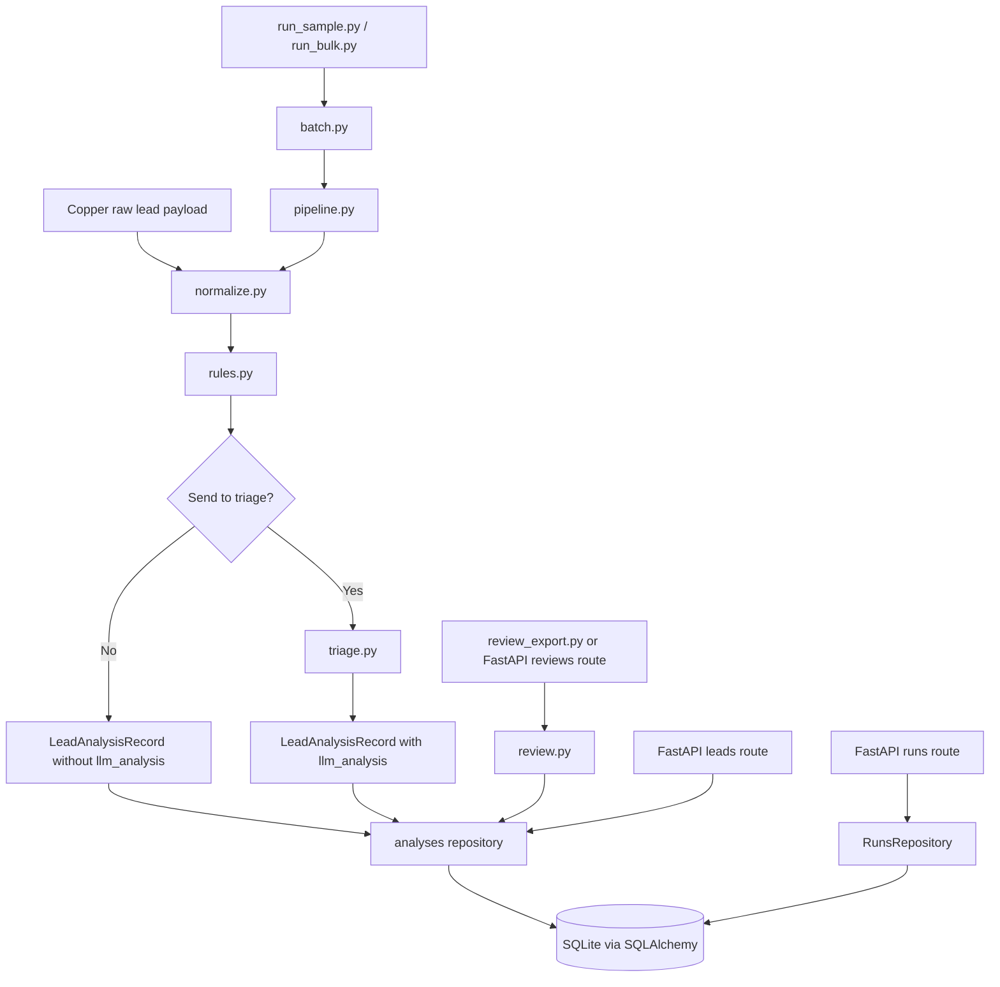
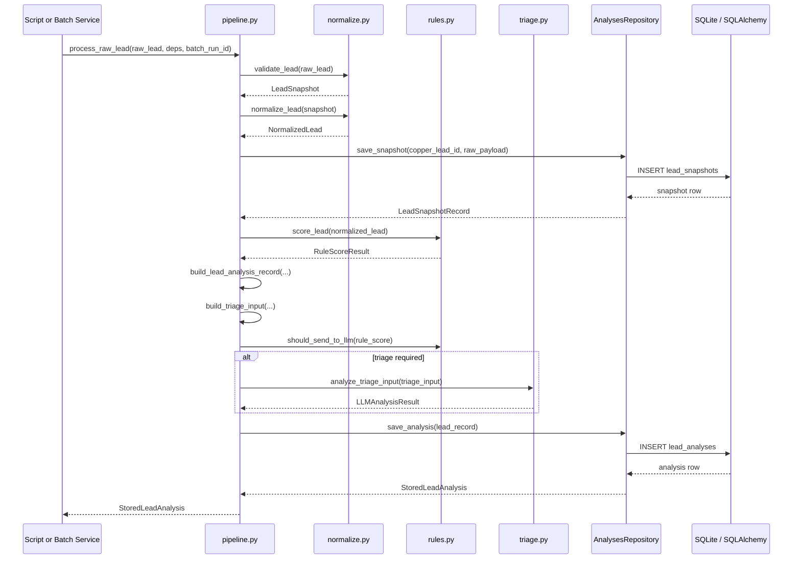
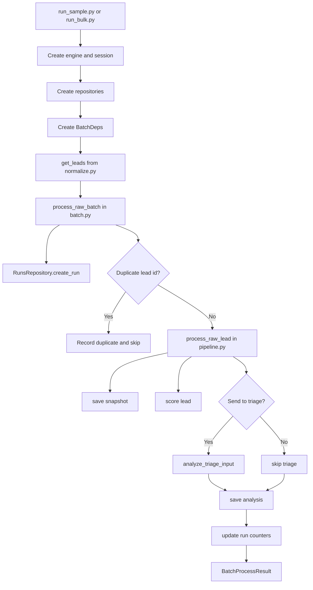
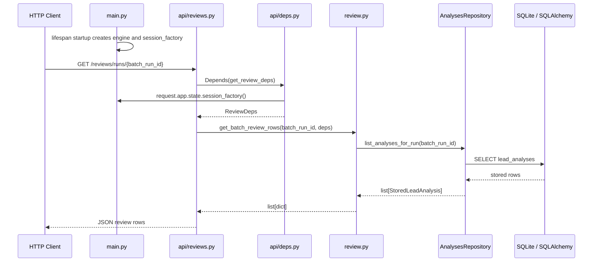

# Lead Triage Engine — System Flow

**Created:** 2026-04-19
**Modified:** 2026-05-01
**Version:** 1.2

**Status:** Active implementation reference
**Related Docs:** [app_architecture.md](/Users/jamesfilios/Software_Projects/copper-lead-triage/docs/app_architecture.md), [build_plan.md](/Users/jamesfilios/Software_Projects/copper-lead-triage/docs/build_plan.md)

---

## Purpose

This document shows how the current backend works end to end as of 2026-05-01. It is meant to make the functional flow visible across modules, services, repositories, scripts, and the first tested FastAPI route wiring.

Use this document when you want to answer questions like:

- where does raw lead data enter the system?
- when do rules run versus triage?
- when does the database get written to?
- how do batch runs call the per-lead pipeline?
- how do review rows get produced and exposed through the API?
- which file owns which step?

---

## Current Runtime Layers

The codebase currently has seven working backend layers:

1. input and normalization
2. deterministic rules
3. triage LLM task
4. persistence
5. per-lead and batch orchestration
6. review workflow and export
7. initial tested FastAPI shell for review, run lookup, and lead latest-analysis lookup

The remaining API layer is still incomplete. Current API work covers app startup, dependency wiring, review routes, read-only run lookup, and read-only latest lead analysis lookup.

---

## High-Level Diagram

---

## Code Ownership Map

### Input and Normalization

- [backend/app/services/normalize.py](/Users/jamesfilios/Software_Projects/copper-lead-triage/backend/app/services/normalize.py)
  - `get_leads(...)`
  - `validate_lead(...)`
  - `normalize_lead(...)`
  - `return_normalized_leads(...)`

### Deterministic Rules

- [backend/app/services/rules.py](/Users/jamesfilios/Software_Projects/copper-lead-triage/backend/app/services/rules.py)
  - `score_lead(...)`
  - `should_send_to_llm(...)`

### Triage LLM Task

- [backend/app/services/triage.py](/Users/jamesfilios/Software_Projects/copper-lead-triage/backend/app/services/triage.py)
  - `should_run_triage(...)`
  - `build_gate_reason(...)`
  - `build_triage_deps(...)`
  - `build_triage_prompt(...)`
  - `analyze_triage_input(...)`
  - `analyze_triage_input_sync(...)`
  - `get_triage_service_metadata(...)`

- [backend/app/clients/llm.py](/Users/jamesfilios/Software_Projects/copper-lead-triage/backend/app/clients/llm.py)
  - `get_triage_model(...)`
  - `get_triage_model_metadata(...)`

### Persistence

- [backend/app/models/db.py](/Users/jamesfilios/Software_Projects/copper-lead-triage/backend/app/models/db.py)
  - `create_database_engine(...)`
  - `create_session_factory(...)`
  - `initialize_database(...)`
  - ORM models: `BatchRunORM`, `LeadSnapshotORM`, `LeadAnalysisORM`, `ReviewDecisionORM`
  - typed DB-facing models: `BatchRun`, `LeadSnapshotRecord`, `StoredLeadAnalysis`, `ReviewDecision`

- [backend/app/repositories/analyses.py](/Users/jamesfilios/Software_Projects/copper-lead-triage/backend/app/repositories/analyses.py)
  - `save_snapshot(...)`
  - `save_analysis(...)`
  - `get_latest_analysis(...)`
  - `list_analyses_for_run(...)`
  - `update_review_status(...)`

- [backend/app/repositories/runs.py](/Users/jamesfilios/Software_Projects/copper-lead-triage/backend/app/repositories/runs.py)
  - `create_run(...)`
  - `get_run(...)`
  - `list_runs(...)`
  - `update_run(...)`

- [backend/app/repositories/reviews.py](/Users/jamesfilios/Software_Projects/copper-lead-triage/backend/app/repositories/reviews.py)
  - `create_review_decision(...)`
  - `get_review_history(...)`

### Review Workflow

- [backend/app/services/review.py](/Users/jamesfilios/Software_Projects/copper-lead-triage/backend/app/services/review.py)
  - `ReviewDeps`
  - `build_review_row(...)`
  - `get_batch_review_rows(...)`
  - `record_review_decision(...)`
  - `get_review_history(...)`

- [backend/scripts/review_export.py](/Users/jamesfilios/Software_Projects/copper-lead-triage/backend/scripts/review_export.py)
  - `parse_args(...)`
  - `write_csv(...)`
  - `write_json(...)`
  - `main(...)`

### Per-Lead Orchestration

- [backend/app/services/pipeline.py](/Users/jamesfilios/Software_Projects/copper-lead-triage/backend/app/services/pipeline.py)
  - `PipelineDeps`
  - `build_lead_analysis_record(...)`
  - `build_triage_input(...)`
  - `process_normalized_lead(...)`
  - `process_raw_lead(...)`

### Batch Orchestration

- [backend/app/services/batch.py](/Users/jamesfilios/Software_Projects/copper-lead-triage/backend/app/services/batch.py)
  - `BatchDeps`
  - `BatchFailure`
  - `BatchProcessResult`
  - `_update_run_progress(...)`
  - `process_raw_batch(...)`
  - `process_normalized_batch(...)`

### Runner Scripts

- [backend/scripts/run_sample.py](/Users/jamesfilios/Software_Projects/copper-lead-triage/backend/scripts/run_sample.py)
  - `parse_args(...)`
  - `main(...)`

- [backend/scripts/run_bulk.py](/Users/jamesfilios/Software_Projects/copper-lead-triage/backend/scripts/run_bulk.py)
  - `parse_args(...)`
  - `main(...)`

### API Shell

- [backend/app/main.py](/Users/jamesfilios/Software_Projects/copper-lead-triage/backend/app/main.py)
  - `lifespan(...)`
  - `app`
  - `health_check(...)`

- [backend/app/api/deps.py](/Users/jamesfilios/Software_Projects/copper-lead-triage/backend/app/api/deps.py)
  - `get_db_session(...)`
  - `get_analyses_repository(...)`
  - `get_reviews_repository(...)`
  - `get_review_deps(...)`
  - `get_runs_repository(...)`
  - `get_pipeline_deps(...)`
  - `get_batch_deps(...)`

- [backend/app/api/reviews.py](/Users/jamesfilios/Software_Projects/copper-lead-triage/backend/app/api/reviews.py)
  - `router`
  - `list_review_rows(...)`
  - `record_decision(...)`
  - `get_review_decision_history(...)`

- [backend/app/api/runs.py](/Users/jamesfilios/Software_Projects/copper-lead-triage/backend/app/api/runs.py)
  - `router`
  - `get_run(...)`
  - `create_sample_run(...)`
  - `create_bulk_run(...)`

- [backend/app/api/leads.py](/Users/jamesfilios/Software_Projects/copper-lead-triage/backend/app/api/leads.py)
  - `router`
  - `get_latest_lead_analysis(...)`

---

## Per-Lead Functional Flow

### Raw Lead Path

The main per-lead entrypoint is `process_raw_lead(...)` in [pipeline.py](/Users/jamesfilios/Software_Projects/copper-lead-triage/backend/app/services/pipeline.py).

It currently runs this sequence:

1. `validate_lead(raw_lead)` in [normalize.py](/Users/jamesfilios/Software_Projects/copper-lead-triage/backend/app/services/normalize.py)
2. `normalize_lead(validated_lead)` in [normalize.py](/Users/jamesfilios/Software_Projects/copper-lead-triage/backend/app/services/normalize.py)
3. `save_snapshot(copper_lead_id, raw_payload)` in [analyses.py](/Users/jamesfilios/Software_Projects/copper-lead-triage/backend/app/repositories/analyses.py)
4. `process_normalized_lead(...)` in [pipeline.py](/Users/jamesfilios/Software_Projects/copper-lead-triage/backend/app/services/pipeline.py)

### Normalized Lead Path

`process_normalized_lead(...)` then runs this sequence:

1. `score_lead(normalized_lead)` in [rules.py](/Users/jamesfilios/Software_Projects/copper-lead-triage/backend/app/services/rules.py)
2. `build_lead_analysis_record(...)` in [pipeline.py](/Users/jamesfilios/Software_Projects/copper-lead-triage/backend/app/services/pipeline.py)
3. `build_triage_input(record)` in [pipeline.py](/Users/jamesfilios/Software_Projects/copper-lead-triage/backend/app/services/pipeline.py)
4. `should_send_to_llm(score)` in [rules.py](/Users/jamesfilios/Software_Projects/copper-lead-triage/backend/app/services/rules.py)
5. if true: `analyze_triage_input(triage_input)` in [triage.py](/Users/jamesfilios/Software_Projects/copper-lead-triage/backend/app/services/triage.py)
6. `save_analysis(lead_record)` in [analyses.py](/Users/jamesfilios/Software_Projects/copper-lead-triage/backend/app/repositories/analyses.py)
7. return `StoredLeadAnalysis`

---

## Per-Lead Sequence Diagram

---

## Batch Functional Flow

The Phase 6 batch layer lives in [backend/app/services/batch.py](/Users/jamesfilios/Software_Projects/copper-lead-triage/backend/app/services/batch.py).

Its job is not to reimplement per-lead logic. Its job is to repeatedly call the pipeline and track run-level metadata.

### Raw Batch Path

`process_raw_batch(...)` does this:

1. `runs_repository.create_run(run_type, total_leads, status="running")`
2. iterate over `raw_leads`
3. skip duplicate `id` values already seen in the current batch
4. for each unique lead:
   - call `process_raw_lead(raw_lead, deps.pipeline_deps, batch_run_id=run.run_id)`
   - append success to `analyses`
   - or append failure to `failures`
5. after each attempt:
   - `_update_run_progress(...)`
   - `runs_repository.update_run(...)`
6. finish with final `status="completed"`
7. return `BatchProcessResult`

### Normalized Batch Path

`process_normalized_batch(...)` is the same pattern, except it calls:

- `process_normalized_lead(...)`

instead of:

- `process_raw_lead(...)`

This makes it useful for testing and offline workflows where normalization already happened earlier.

---

## Batch Diagram

---

## Review And API Flow

The review workflow starts from saved `lead_analyses` rows. It does not rerun Copper fetches, rules, triage, or pipeline processing.

### Review Export Path

`backend/scripts/review_export.py` does this:

1. create a database engine and initialize tables
2. create one SQLAlchemy session
3. build `ReviewDeps`
4. call `get_batch_review_rows(batch_run_id, deps)` in [review.py](/Users/jamesfilios/Software_Projects/copper-lead-triage/backend/app/services/review.py)
5. write the returned rows to CSV or JSON

### Review API Paths

`GET /reviews/runs/{batch_run_id}` does this:

1. FastAPI receives the request in [api/reviews.py](/Users/jamesfilios/Software_Projects/copper-lead-triage/backend/app/api/reviews.py)
2. `Depends(get_review_deps)` asks [api/deps.py](/Users/jamesfilios/Software_Projects/copper-lead-triage/backend/app/api/deps.py) to build the service dependencies
3. `get_db_session(...)` creates a request-scoped SQLAlchemy session from `request.app.state.session_factory`
4. repository dependencies wrap that session
5. `get_review_deps(...)` returns `ReviewDeps`
6. the route calls `get_batch_review_rows(...)`
7. the review service loads saved analyses through `AnalysesRepository`
8. the route returns flattened review rows

`POST /reviews/{analysis_id}` records a human review decision through `record_review_decision(...)`. The route translates missing analyses into HTTP `404`.

`GET /reviews/{analysis_id}/history` returns saved review decisions through `get_review_history(...)`.

### Run API Path

`GET /runs/{run_id}` is read-only and does this:

1. FastAPI receives the request in [api/runs.py](/Users/jamesfilios/Software_Projects/copper-lead-triage/backend/app/api/runs.py)
2. `Depends(get_runs_repository)` asks [api/deps.py](/Users/jamesfilios/Software_Projects/copper-lead-triage/backend/app/api/deps.py) for a request-scoped repository
3. the route calls `RunsRepository.get_run(run_id)`
4. a missing run returns HTTP `404`
5. an existing run returns `BatchRun`

The existing `POST /runs/sample` and `POST /runs/bulk` routes trigger Copper fetch and batch processing. They exist in code but should be treated as execution endpoints and exercised cautiously until safety controls and tests are clearer.

### Lead API Path

`GET /leads/{copper_lead_id}/analysis` is read-only and does this:

1. FastAPI receives the request in [api/leads.py](/Users/jamesfilios/Software_Projects/copper-lead-triage/backend/app/api/leads.py)
2. `Depends(get_analyses_repository)` asks [api/deps.py](/Users/jamesfilios/Software_Projects/copper-lead-triage/backend/app/api/deps.py) for a request-scoped repository
3. the route calls `AnalysesRepository.get_latest_analysis(copper_lead_id)`
4. a missing saved analysis returns HTTP `404`
5. an existing analysis returns `StoredLeadAnalysis`

`POST /leads/score` remains deferred. Do not add it until its input contract is explicit: raw lead JSON, normalized lead JSON, or Copper lead ID each imply different safety and orchestration behavior.

---

## Current Test Coverage Map

### Rules

- [tests/test_rules.py](/Users/jamesfilios/Software_Projects/copper-lead-triage/tests/test_rules.py)
  - deterministic scoring contract
  - `pursue`, `research`, `hold`, `reject` paths

### Triage

- [tests/test_triage_contracts.py](/Users/jamesfilios/Software_Projects/copper-lead-triage/tests/test_triage_contracts.py)
  - triage gating
  - prompt construction
  - deps shaping
  - service metadata

### Persistence

- [tests/test_repositories.py](/Users/jamesfilios/Software_Projects/copper-lead-triage/tests/test_repositories.py)
  - schema creation
  - runs
  - analyses
  - reviews
  - timestamp and JSON round-tripping

### Pipeline

- [tests/test_pipeline.py](/Users/jamesfilios/Software_Projects/copper-lead-triage/tests/test_pipeline.py)
  - triage skipped path
  - triage used path
  - raw lead snapshot + analysis persistence

### Batch

- [tests/test_batch.py](/Users/jamesfilios/Software_Projects/copper-lead-triage/tests/test_batch.py)
  - continue after failure
  - duplicate lead handling
  - run counter updates

### Review

- [tests/test_review.py](/Users/jamesfilios/Software_Projects/copper-lead-triage/tests/test_review.py)
  - review row shaping with and without LLM output
  - batch review row lookup
  - review decision persistence
  - review history and effective review status updates

### API

- [tests/test_api_reviews.py](/Users/jamesfilios/Software_Projects/copper-lead-triage/tests/test_api_reviews.py)
  - health check
  - review rows by batch run
  - review decision writes
  - review decision history
  - missing analysis `404`

- [tests/test_api_runs.py](/Users/jamesfilios/Software_Projects/copper-lead-triage/tests/test_api_runs.py)
  - run lookup
  - missing run `404`

- [tests/test_api_leads.py](/Users/jamesfilios/Software_Projects/copper-lead-triage/tests/test_api_leads.py)
  - latest saved lead analysis lookup
  - missing saved lead analysis `404`

---

## Current Gaps

The current flow is functional, but these pieces are still incomplete:

- `backend/app/clients/enrichment.py`
- shared API test fixtures to reduce duplication across `tests/test_api_*.py`
- cleanup of API route formatting and unused imports
- safe tests and contracts for execution endpoints that trigger Copper or LLM work

That means the backend core works locally through services and scripts, and the HTTP wrapper now exposes tested saved-data and review endpoints. The next API work should focus on cleanup before adding routes that perform new external work.

---

## Practical Reading Order

If you want to understand the current system by reading code in the most logical order, use this sequence:

1. [backend/app/models/lead.py](/Users/jamesfilios/Software_Projects/copper-lead-triage/backend/app/models/lead.py)
2. [backend/app/models/analysis.py](/Users/jamesfilios/Software_Projects/copper-lead-triage/backend/app/models/analysis.py)
3. [backend/app/services/normalize.py](/Users/jamesfilios/Software_Projects/copper-lead-triage/backend/app/services/normalize.py)
4. [backend/app/services/rules.py](/Users/jamesfilios/Software_Projects/copper-lead-triage/backend/app/services/rules.py)
5. [backend/app/services/triage.py](/Users/jamesfilios/Software_Projects/copper-lead-triage/backend/app/services/triage.py)
6. [backend/app/models/db.py](/Users/jamesfilios/Software_Projects/copper-lead-triage/backend/app/models/db.py)
7. [backend/app/repositories/analyses.py](/Users/jamesfilios/Software_Projects/copper-lead-triage/backend/app/repositories/analyses.py)
8. [backend/app/repositories/runs.py](/Users/jamesfilios/Software_Projects/copper-lead-triage/backend/app/repositories/runs.py)
9. [backend/app/services/pipeline.py](/Users/jamesfilios/Software_Projects/copper-lead-triage/backend/app/services/pipeline.py)
10. [backend/app/services/batch.py](/Users/jamesfilios/Software_Projects/copper-lead-triage/backend/app/services/batch.py)
11. [backend/app/services/review.py](/Users/jamesfilios/Software_Projects/copper-lead-triage/backend/app/services/review.py)
12. [backend/scripts/run_sample.py](/Users/jamesfilios/Software_Projects/copper-lead-triage/backend/scripts/run_sample.py)
13. [backend/scripts/run_bulk.py](/Users/jamesfilios/Software_Projects/copper-lead-triage/backend/scripts/run_bulk.py)
14. [backend/scripts/review_export.py](/Users/jamesfilios/Software_Projects/copper-lead-triage/backend/scripts/review_export.py)
15. [backend/app/main.py](/Users/jamesfilios/Software_Projects/copper-lead-triage/backend/app/main.py)
16. [backend/app/api/deps.py](/Users/jamesfilios/Software_Projects/copper-lead-triage/backend/app/api/deps.py)
17. [backend/app/api/reviews.py](/Users/jamesfilios/Software_Projects/copper-lead-triage/backend/app/api/reviews.py)
18. [backend/app/api/runs.py](/Users/jamesfilios/Software_Projects/copper-lead-triage/backend/app/api/runs.py)
19. [backend/app/api/leads.py](/Users/jamesfilios/Software_Projects/copper-lead-triage/backend/app/api/leads.py)

---

## Changelog

| Version | Date       | Description |
|---------|------------|-------------|
| 1.2     | 2026-05-01 | Recorded the tested API routes for reviews, run lookup, and latest lead analysis lookup, and documented deferred execution endpoints |
| 1.1     | 2026-04-27 | Added review workflow, review export, and initial FastAPI lifespan/dependency/review-route flow details |
| 1.0     | 2026-04-19 | Created a detailed visual and code-referenced system flow document covering the current normalize -> rules -> triage -> persistence -> pipeline -> batch architecture |
